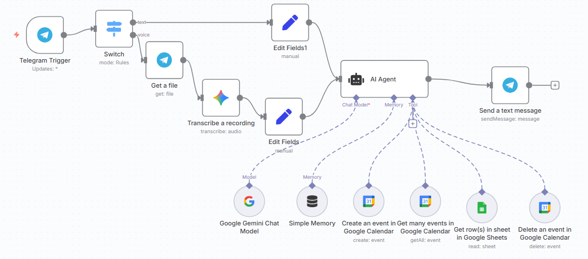

# 📅 Telegram AI Appointment Scheduler – n8n Workflow

This repository contains an **n8n** workflow that integrates **Telegram**, **Google Gemini AI**, **Google Calendar**, and **Google Sheets** to create an **AI-powered appointment scheduling assistant**.

## 🚀 Features
- 📩 Accepts **text messages** or **voice notes** from Telegram users.
- 🗣 **Transcribes audio messages** into text.
- 🤖 Uses **Google Gemini AI** to understand user intent and process scheduling requests.
- 📅 **Creates, retrieves, and deletes events** in Google Calendar.
- 📊 **Reads appointment data** from Google Sheets.
- 💾 Maintains **conversation memory** for better AI context.
- 📤 Sends **AI-generated responses** back to Telegram.

---

## 📌 Workflow Overview

### **Step-by-step Process**
1. **Telegram Trigger** – Starts when a Telegram message or voice note is received.
2. **Switch (Mode: Rules)** – Routes:
   - **Text messages** → Direct AI processing.
   - **Voice messages** → Download and transcribe first.
3. **Get a File & Transcribe a Recording** – Downloads voice note and converts audio to text.
4. **Edit Fields** – Cleans and formats message text.
5. **AI Agent** – Powered by Google Gemini AI:
   - Understands requests.
   - Uses memory for context.
   - Executes actions in Google Calendar & Google Sheets.
6. **Google Calendar & Sheets Operations** – Create, retrieve, or delete events; fetch sheet data.
7. **Send a Text Message** – Sends confirmation or requested information back to Telegram.

---

## 🛠 Prerequisites
Before importing this workflow into n8n, ensure you have:
- **n8n** installed (locally or on a server).
- **Telegram Bot Token** from [BotFather](https://core.telegram.org/bots#botfather).
- **Google Cloud Project** with:
  - Google Calendar API enabled
  - Google Sheets API enabled
  - Service account credentials
- **Google Gemini API** access.
- API credentials for transcription (if using an external service).

---

## ⚙️ Setup Instructions

1. **Import the Workflow**
   - Open n8n → Workflows → *Import from File*.
   - Upload the workflow JSON file.

2. **Configure Telegram Trigger**
   - Add your Telegram bot token.
   - Enable updates for text and voice messages.

3. **Set API Credentials in n8n**
   - Google Calendar
   - Google Sheets
   - Google Gemini Chat Model
   - (Optional) Audio transcription service

4. **Test the Workflow**
   - Send a message or voice note to your Telegram bot.
   - The AI will process your request and update Google Calendar/Sheets.

---

## 📄 Example Usage

**User:**  
> Book a meeting with John tomorrow at 3 PM.

**AI Response:**  
✅ Your meeting with John has been added to Google Calendar for tomorrow at 3:00 PM.

---

## 📜 License
This project is licensed under the MIT License.
